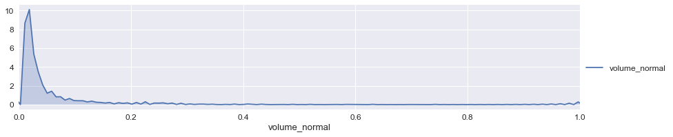
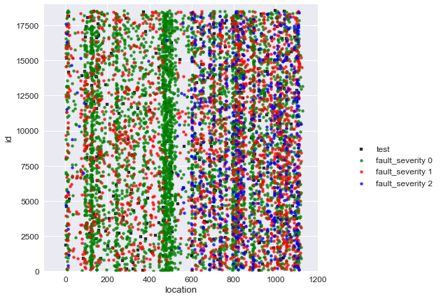
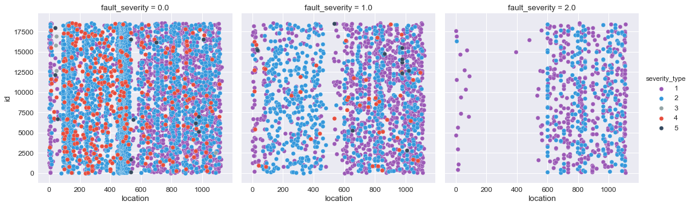
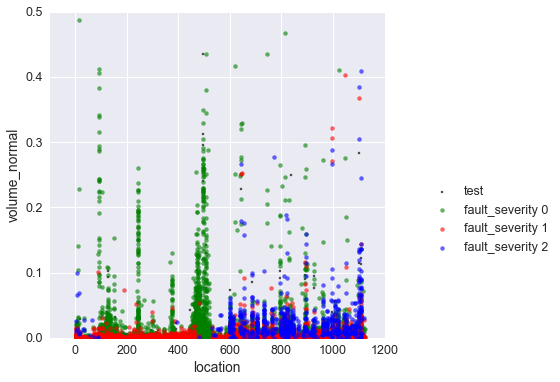
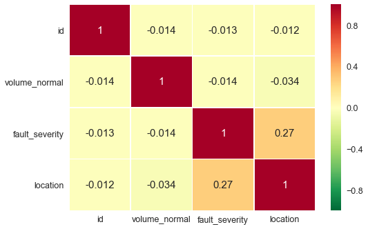
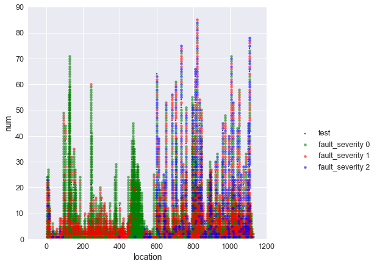
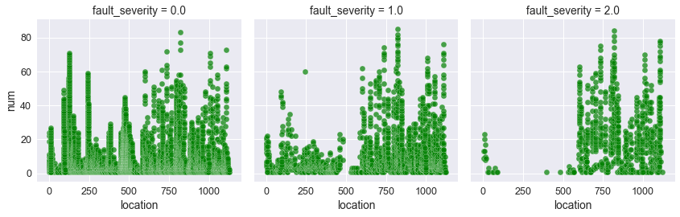
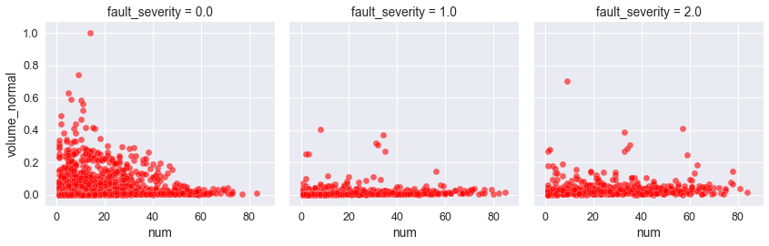
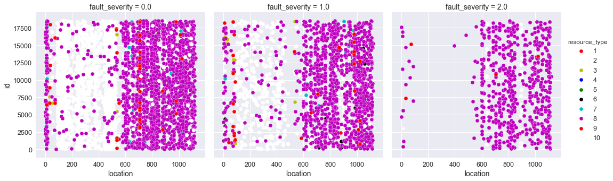
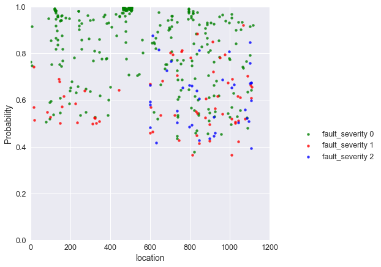

# Service Disruption Prediction project

#### The main aim of this project was to get hands on with real-world data cleaning and preparation.

__The dataset for this project was provided by an Australian telecom company <font color=blue>Telstra</font> which can be found <font color=blue>here</font> on Kaggle.__ 

__<font color=red>The Business Problem:</font> The company's network infrastructure is geographically distributed across different regions & which would need repairs. Some of the service areas were in very remote areas and if service disrupts in those regions, it might take some time for tech support to fix it resulting in many of their customers without service, thus  tarnishing their reputation and losing customer. So, the goal was to fix service network areas that model predicts would fail in order to prevent the disruption.__ 

__I applied <font color=red>CRISP-DM model</font> to solve this problem__

### Import Libraries


```python
from functools import reduce
import numpy as np
import pandas as pd
import matplotlib.pyplot as plt
import seaborn as sns
%matplotlib inline
import warnings
warnings.filterwarnings('ignore')
warnings.simplefilter('ignore')
```

__The dataset for this project is divided into 5 different csv files each containing information about different aspects of the business problem__
__As mentioned in the data source, File descriptions__


-  train.csv - the training set for fault severity
-  test.csv - the test set for fault severity
-  event_type.csv - event type related to the main dataset
-  log_feature.csv - features extracted from log files
-  resource_type.csv - type of resource related to the main dataset
-  severity_type.csv -  severity type of a warning message coming from the log

__The goal is to predict Telstra network's fault severity at a time at a particular location based on the log data available__

### Import Training & Test Data


```python
train = pd.read_csv("train.csv")

event = pd.read_csv("event_type.csv")

severity = pd.read_csv("severity_type.csv")

log_feature = pd.read_csv("log_feature.csv")

resource = pd.read_csv("resource_type.csv")

test = pd.read_excel("test_pbl.csv",header = None)
test.columns = ['id','location']


train.shape,event.shape,severity.shape,log_feature.shape,resource.shape,test.shape
```


    ((7008, 3), (31170, 2), (18552, 2), (58671, 3), (21076, 2), (373, 2))


```python
print(train.head())
print(event.head())
print(severity.head())
print(log_feature.head())
print(resource.head())
print(test.head())
```

          id      location  fault_severity
    0  14121  location 118               1
    1   9320   location 91               0
    2  14394  location 152               1
    3   8218  location 931               1
    4  14804  location 120               0
         id     event_type
    0  6597  event_type 11
    1  8011  event_type 15
    2  2597  event_type 15
    3  5022  event_type 15
    4  5022  event_type 11
         id    severity_type
    0  6597  severity_type 2
    1  8011  severity_type 2
    2  2597  severity_type 2
    3  5022  severity_type 1
    4  6852  severity_type 1
         id  log_feature  volume
    0  6597   feature 68       6
    1  8011   feature 68       7
    2  2597   feature 68       1
    3  5022  feature 172       2
    4  5022   feature 56       1
         id    resource_type
    0  6597  resource_type 8
    1  8011  resource_type 8
    2  2597  resource_type 8
    3  5022  resource_type 8
    4  6852  resource_type 8
          id      location
    0  11695  location 244
    1  15412  location 845
    2   1972  location 922
    3     64  location 921
    4   2897  location 878
    

__There are unnecessary strings like 'location' or 'feature' in all rows of dataframes respectively. I only needed the integer values. So I removed these string values.__

### Extract the integers from columns and remove strings


```python
train['location'] = train['location'].str.extract('(\d+)', expand =True)
event['event_type'] = event['event_type'].str.extract('(\d+)', expand =True)
severity['severity_type'] = severity['severity_type'].str.extract('(\d+)', expand =True)
log_feature['log_feature'] = log_feature['log_feature'].str.extract('(\d+)', expand =True)
resource['resource_type'] = resource['resource_type'].str.extract('(\d+)', expand =True)
test['location'] = test['location'].str.extract('(\d+)', expand =True)

```

### Data Preprocessing and Merging to create a Customer Analytical record (CAR)


```python
tt = train.append(test)
tt.info()
```

    <class 'pandas.core.frame.DataFrame'>
    Int64Index: 7381 entries, 0 to 372
    Data columns (total 3 columns):
    fault_severity    7008 non-null float64
    id                7381 non-null int64
    location          7381 non-null object
    dtypes: float64(1), int64(1), object(1)
    memory usage: 230.7+ KB
    


```python
l = [event, severity, log_feature, resource]
df = reduce(lambda left,right: pd.merge(left,right,on='id'), l)
df.info()
```

    <class 'pandas.core.frame.DataFrame'>
    Int64Index: 146423 entries, 0 to 146422
    Data columns (total 6 columns):
    id               146423 non-null int64
    event_type       146423 non-null object
    severity_type    146423 non-null object
    log_feature      146423 non-null object
    volume           146423 non-null int64
    resource_type    146423 non-null object
    dtypes: int64(2), object(4)
    memory usage: 7.8+ MB
    


```python
x = tt.drop('fault_severity',axis = 1)
df = pd.merge(df,x,on = 'id')
df = df[['id','location','event_type','resource_type','severity_type','log_feature','volume']]
df.head()
```


<div>
<style>
    .dataframe thead tr:only-child th {
        text-align: right;
    }

    .dataframe thead th {
        text-align: left;
    }

    .dataframe tbody tr th {
        vertical-align: top;
    }
</style>
<table border="1" class="dataframe">
  <thead>
    <tr style="text-align: right;">
      <th></th>
      <th>id</th>
      <th>location</th>
      <th>event_type</th>
      <th>resource_type</th>
      <th>severity_type</th>
      <th>log_feature</th>
      <th>volume</th>
    </tr>
  </thead>
  <tbody>
    <tr>
      <th>0</th>
      <td>8011</td>
      <td>1</td>
      <td>15</td>
      <td>8</td>
      <td>2</td>
      <td>68</td>
      <td>7</td>
    </tr>
    <tr>
      <th>1</th>
      <td>2588</td>
      <td>1</td>
      <td>15</td>
      <td>8</td>
      <td>1</td>
      <td>82</td>
      <td>9</td>
    </tr>
    <tr>
      <th>2</th>
      <td>2588</td>
      <td>1</td>
      <td>15</td>
      <td>8</td>
      <td>1</td>
      <td>201</td>
      <td>5</td>
    </tr>
    <tr>
      <th>3</th>
      <td>2588</td>
      <td>1</td>
      <td>15</td>
      <td>8</td>
      <td>1</td>
      <td>80</td>
      <td>15</td>
    </tr>
    <tr>
      <th>4</th>
      <td>2588</td>
      <td>1</td>
      <td>15</td>
      <td>8</td>
      <td>1</td>
      <td>203</td>
      <td>5</td>
    </tr>
  </tbody>
</table>
</div>


__As you saw in previous cell, there are 373 Null 'fault_severity' values from Test data which we have to predict.So I dropped the 'fault_severity' and merged rest of the columns on 'id' to create my final dataframe for exploration__


```python
df.info()
```

    <class 'pandas.core.frame.DataFrame'>
    Int64Index: 61839 entries, 0 to 61838
    Data columns (total 7 columns):
    id               61839 non-null int64
    location         61839 non-null object
    event_type       61839 non-null object
    resource_type    61839 non-null object
    severity_type    61839 non-null object
    log_feature      61839 non-null object
    volume           61839 non-null int64
    dtypes: int64(2), object(5)
    memory usage: 3.8+ MB
    

### Check for duplicate data


```python
df[df.duplicated()]
```


<div>
<style>
    .dataframe thead tr:only-child th {
        text-align: right;
    }

    .dataframe thead th {
        text-align: left;
    }

    .dataframe tbody tr th {
        vertical-align: top;
    }
</style>
<table border="1" class="dataframe">
  <thead>
    <tr style="text-align: right;">
      <th></th>
      <th>id</th>
      <th>location</th>
      <th>event_type</th>
      <th>resource_type</th>
      <th>severity_type</th>
      <th>log_feature</th>
      <th>volume</th>
    </tr>
  </thead>
  <tbody>
  </tbody>
</table>
</div>


```python
l = df.columns
for a in l[:len(l)-1]:
    print('number of unique ' + a + ' : ' + str(df[a].nunique()))   
```

    number of unique id : 7381
    number of unique location : 929
    number of unique event_type : 49
    number of unique resource_type : 10
    number of unique severity_type : 5
    number of unique log_feature : 331
    

### Feature Engineering


```python
#total volume per id
total_volume = log_feature.groupby(['id'],as_index = False)[['volume']].sum()
total_volume.columns = ['id','total_volume']
```


```python
df.severity_type.value_counts()
```


    1    36571
    2    24260
    4      920
    5       55
    3       33
    Name: severity_type, dtype: int64


```python
total_volume['total_volume'].describe()
```


    count    18552.000000
    mean        30.629905
    std         77.755460
    min          1.000000
    25%          3.000000
    50%          8.000000
    75%         25.000000
    max       1649.000000
    Name: total_volume, dtype: float64


__As we see,the Volume varible varies from 1-1649 & has a very big scale.I down-scaled the featured so that it is easy to train the model on this variable__

### Normalise the Volume Column


```python
from sklearn import preprocessing

# Create x, where x the 'volume' column's values as floats
x = total_volume['total_volume'].values.astype(float)

# Create a minimum and maximum processor object
min_max_scaler = preprocessing.MinMaxScaler()

# Create an object to transform the data to fit minmax processor
x_scaled = min_max_scaler.fit_transform(x)


# Run the normalizer on the dataframe
volume_normal = pd.DataFrame(x_scaled)
volume_normal.columns = ['volume_normal']


#concat the normalizsed volume column to main dataframe
total_volume = pd.concat([total_volume,volume_normal],axis = 1)
```


```python
loc_vol_features =pd.merge(total_volume[['id','volume_normal']],tt,on='id',how = 'inner')

loc_vol_features.describe()
```


<div>
<style>
    .dataframe thead tr:only-child th {
        text-align: right;
    }

    .dataframe thead th {
        text-align: left;
    }

    .dataframe tbody tr th {
        vertical-align: top;
    }
</style>
<table border="1" class="dataframe">
  <thead>
    <tr style="text-align: right;">
      <th></th>
      <th>id</th>
      <th>volume_normal</th>
      <th>fault_severity</th>
    </tr>
  </thead>
  <tbody>
    <tr>
      <th>count</th>
      <td>7381.000000</td>
      <td>7381.000000</td>
      <td>7008.000000</td>
    </tr>
    <tr>
      <th>mean</th>
      <td>9264.649099</td>
      <td>0.018702</td>
      <td>0.450342</td>
    </tr>
    <tr>
      <th>std</th>
      <td>5349.290176</td>
      <td>0.047893</td>
      <td>0.665220</td>
    </tr>
    <tr>
      <th>min</th>
      <td>1.000000</td>
      <td>0.000000</td>
      <td>0.000000</td>
    </tr>
    <tr>
      <th>25%</th>
      <td>4647.000000</td>
      <td>0.001214</td>
      <td>0.000000</td>
    </tr>
    <tr>
      <th>50%</th>
      <td>9222.000000</td>
      <td>0.004248</td>
      <td>0.000000</td>
    </tr>
    <tr>
      <th>75%</th>
      <td>13885.000000</td>
      <td>0.014563</td>
      <td>1.000000</td>
    </tr>
    <tr>
      <th>max</th>
      <td>18550.000000</td>
      <td>1.000000</td>
      <td>2.000000</td>
    </tr>
  </tbody>
</table>
</div>


```python
features = pd.merge(severity,loc_vol_features,on='id',how='inner')

features['location'] = features['location'].astype(int)
features.head()
```


<div>
<style>
    .dataframe thead tr:only-child th {
        text-align: right;
    }

    .dataframe thead th {
        text-align: left;
    }

    .dataframe tbody tr th {
        vertical-align: top;
    }
</style>
<table border="1" class="dataframe">
  <thead>
    <tr style="text-align: right;">
      <th></th>
      <th>id</th>
      <th>severity_type</th>
      <th>volume_normal</th>
      <th>fault_severity</th>
      <th>location</th>
    </tr>
  </thead>
  <tbody>
    <tr>
      <th>0</th>
      <td>8011</td>
      <td>2</td>
      <td>0.003641</td>
      <td>0.0</td>
      <td>1</td>
    </tr>
    <tr>
      <th>1</th>
      <td>2588</td>
      <td>1</td>
      <td>0.020024</td>
      <td>0.0</td>
      <td>1</td>
    </tr>
    <tr>
      <th>2</th>
      <td>4848</td>
      <td>1</td>
      <td>0.020631</td>
      <td>0.0</td>
      <td>1</td>
    </tr>
    <tr>
      <th>3</th>
      <td>6914</td>
      <td>1</td>
      <td>0.006068</td>
      <td>0.0</td>
      <td>1</td>
    </tr>
    <tr>
      <th>4</th>
      <td>5337</td>
      <td>1</td>
      <td>0.014563</td>
      <td>0.0</td>
      <td>1</td>
    </tr>
  </tbody>
</table>
</div>


### Data Visualization


```python
#Total Volume distribution in features
sns.set(font_scale = 1.2)
facet = sns.FacetGrid( loc_vol_features ,  aspect=4)
facet.map( sns.kdeplot , 'volume_normal' , shade= True )
facet.set( xlim=( 0 , loc_vol_features['volume_normal'].max()) )
facet.add_legend()
```


    <seaborn.axisgrid.FacetGrid at 0x16f7cfc5278>





```python
# Plot of fault types across different locations and ids
fig, ax1 = plt.subplots(figsize=(7,7))
ax1.scatter(features.loc[features.fault_severity.isnull(),'location'],features.loc[features.fault_severity.isnull(),'id'],alpha=0.8,marker = 's',color='k',s=12,label = 'test')
ax1.scatter(features.loc[features.fault_severity==0,'location'],features.loc[features.fault_severity==0,'id'],alpha=0.8,color='g',label = 'fault_severity 0',s= 16)
ax1.scatter(features.loc[features.fault_severity==1,'location'],features.loc[features.fault_severity==1,'id'],alpha=0.8,color='r',label = 'fault_severity 1',s= 16)
ax1.scatter(features.loc[features.fault_severity==2,'location'],features.loc[features.fault_severity==2,'id'],alpha=0.8,color='b',label = 'fault_severity 2',s= 16)
ax1.set_xlim((-100,1200))
ax1.set_ylim((0,19000))
ax1.set_xlabel('location')
ax1.set_ylabel('id')
ax1.legend(bbox_to_anchor=(1.1, 0.5), loc='upper left')
```


    <matplotlib.legend.Legend at 0x16f0482a828>





__As you see from the Plot of Severity types across different id and locations for each fault types__
-  __Fault severity 2 occurs largely for location greater than 600__
-  __Fault severity 1 has a gap between location 450-550__


```python
flatui = ["#9b59b6", "#3498db", "#95a5a6", "#e74c3c", "#34495e", "#2ecc71"]
g = sns.FacetGrid(features, col="fault_severity",size = 5,hue = 'severity_type',palette =flatui )
g = (g.map(plt.scatter, "location", "id", edgecolor="w").add_legend())
```





```python
#Heatmap and Stacked Barplot for Severity type and Fault type

fault_type_total = pd.crosstab(features['severity_type'],features['fault_severity'])
# Normalize the cross tab to sum to 1 & Plot:
fault_type_ntotal = fault_type_total.div(fault_type_total.sum(1).astype(float), axis=0)


fig = plt.figure(figsize = (8,4))
ax1= fig.add_subplot(121)
ax2= fig.add_subplot(122)

sns.set(font_scale = 1.13)
sns.heatmap(fault_type_total,cmap='RdYlGn_r', linewidths=0.5, annot=True,ax=ax1)

plot1 = fault_type_ntotal.plot(kind='barh',stacked=True,title='Fault type by severity types',ax=ax2,colormap = 'viridis')
plt.xlabel('Fault type')
plt.ylabel('severity types')
plt.legend(bbox_to_anchor=(1.1, 0.5), loc='upper left', ncol=1)

plt.tight_layout()
plt.show()
```


```python
# Plot of Volumne vs location
sns.set(font_scale = 1.25)
fig, ax1 = plt.subplots(figsize=(6,6))
ax1.scatter(features.loc[features.fault_severity.isnull(),'location'],features.loc[features.fault_severity.isnull(),'volume_normal'],alpha=0.6,marker = 's',color='k',s=8,label = 'test')
ax1.scatter(features.loc[features.fault_severity==0,'location'],features.loc[features.fault_severity==0,'volume_normal'],alpha=0.6,color='g',label = 'fault_severity 0',s= 16)
ax1.scatter(features.loc[features.fault_severity==1,'location'],features.loc[features.fault_severity==1,'volume_normal'],alpha=0.6,color='r',label = 'fault_severity 1',s= 16)
ax1.scatter(features.loc[features.fault_severity==2,'location'],features.loc[features.fault_severity==2,'volume_normal'],alpha=0.6,color='b',label = 'fault_severity 2',s= 16)
ax1.set_xlim((-100,1200))
ax1.set_ylim((0,0.5))
ax1.set_xlabel('location')
ax1.set_ylabel('volume_normal')
ax1.legend(bbox_to_anchor=(1.1, 0.5), loc='upper left')
```


    <matplotlib.legend.Legend at 0x16f0dcd7cc0>





__I didn't find a significant correlation between the features__


```python
feature_cor = features.corr()
sns.heatmap(feature_cor,cmap='RdYlGn_r', linewidths=0.5, annot=True)
```


    <matplotlib.axes._subplots.AxesSubplot at 0x16f04989be0>





```python
#Adding a number feature for location 
features['num'] = features.groupby(['location']).cumcount()+1
features.head()
```


<div>
<style>
    .dataframe thead tr:only-child th {
        text-align: right;
    }

    .dataframe thead th {
        text-align: left;
    }

    .dataframe tbody tr th {
        vertical-align: top;
    }
</style>
<table border="1" class="dataframe">
  <thead>
    <tr style="text-align: right;">
      <th></th>
      <th>id</th>
      <th>severity_type</th>
      <th>volume_normal</th>
      <th>fault_severity</th>
      <th>location</th>
      <th>num</th>
    </tr>
  </thead>
  <tbody>
    <tr>
      <th>0</th>
      <td>8011</td>
      <td>2</td>
      <td>0.003641</td>
      <td>0.0</td>
      <td>1</td>
      <td>1</td>
    </tr>
    <tr>
      <th>1</th>
      <td>2588</td>
      <td>1</td>
      <td>0.020024</td>
      <td>0.0</td>
      <td>1</td>
      <td>2</td>
    </tr>
    <tr>
      <th>2</th>
      <td>4848</td>
      <td>1</td>
      <td>0.020631</td>
      <td>0.0</td>
      <td>1</td>
      <td>3</td>
    </tr>
    <tr>
      <th>3</th>
      <td>6914</td>
      <td>1</td>
      <td>0.006068</td>
      <td>0.0</td>
      <td>1</td>
      <td>4</td>
    </tr>
    <tr>
      <th>4</th>
      <td>5337</td>
      <td>1</td>
      <td>0.014563</td>
      <td>0.0</td>
      <td>1</td>
      <td>5</td>
    </tr>
  </tbody>
</table>
</div>


```python
features.tail(5)
```


<div>
<style>
    .dataframe thead tr:only-child th {
        text-align: right;
    }

    .dataframe thead th {
        text-align: left;
    }

    .dataframe tbody tr th {
        vertical-align: top;
    }
</style>
<table border="1" class="dataframe">
  <thead>
    <tr style="text-align: right;">
      <th></th>
      <th>id</th>
      <th>severity_type</th>
      <th>volume_normal</th>
      <th>fault_severity</th>
      <th>location</th>
      <th>num</th>
    </tr>
  </thead>
  <tbody>
    <tr>
      <th>7376</th>
      <td>6288</td>
      <td>1</td>
      <td>0.001214</td>
      <td>1.0</td>
      <td>999</td>
      <td>2</td>
    </tr>
    <tr>
      <th>7377</th>
      <td>13296</td>
      <td>1</td>
      <td>0.000000</td>
      <td>1.0</td>
      <td>999</td>
      <td>3</td>
    </tr>
    <tr>
      <th>7378</th>
      <td>8114</td>
      <td>2</td>
      <td>0.001820</td>
      <td>0.0</td>
      <td>999</td>
      <td>4</td>
    </tr>
    <tr>
      <th>7379</th>
      <td>878</td>
      <td>2</td>
      <td>0.000000</td>
      <td>0.0</td>
      <td>999</td>
      <td>5</td>
    </tr>
    <tr>
      <th>7380</th>
      <td>4464</td>
      <td>1</td>
      <td>0.001214</td>
      <td>0.0</td>
      <td>999</td>
      <td>6</td>
    </tr>
  </tbody>
</table>
</div>


__Plotting the new number feature vs location__
-  __We see higher average number of different ids for same location for locations greater than 600__
-  __Location 400 to 600 contains most of the faults with type zero__


```python
fig, ax1 = plt.subplots(figsize=(7,7))
ax1.scatter(features.loc[features.fault_severity.isnull(),'location'],features.loc[features.fault_severity.isnull(),'num'],alpha=0.6,marker = 's',color='k',s=8,label = 'test')
ax1.scatter(features.loc[features.fault_severity==0,'location'],features.loc[features.fault_severity==0,'num'],alpha=0.6,color='g',label = 'fault_severity 0',s= 16)
ax1.scatter(features.loc[features.fault_severity==1,'location'],features.loc[features.fault_severity==1,'num'],alpha=0.6,color='r',label = 'fault_severity 1',s= 16)
ax1.scatter(features.loc[features.fault_severity==2,'location'],features.loc[features.fault_severity==2,'num'],alpha=0.6,color='b',label = 'fault_severity 2',s= 16)
ax1.set_xlim((-100,1200))
ax1.set_ylim((0,90))
ax1.set_xlabel('location')
ax1.set_ylabel('num')
ax1.legend(bbox_to_anchor=(1.1, 0.5), loc='upper left')
```


    <matplotlib.legend.Legend at 0x16f0e423748>





```python
g = sns.FacetGrid(features, col="fault_severity",size = 4)
g = g.map(plt.scatter, "location", "num", edgecolor="w",alpha = 0.7,color = 'g')
```





__Based on my findings from feature exploration, I created another feature called location group.__


```python
def location_grp(data):
    if data < 450:
        return 'lower_location'
    elif data <550:
        return 'middle_location'
    else:
        return 'higher_location'
features['location_grp'] = features['location'].apply(location_grp)
```


```python
g = sns.FacetGrid(features, col="fault_severity",size = 4)
g = g.map(plt.scatter, "num", "volume_normal", edgecolor="w",alpha= 0.6,color = 'r')
```





```python
resource_feature = pd.merge(tt,resource,on='id',how ='inner')
resource_feature['resource_type'] = resource_feature['resource_type'].astype(int)
resource_feature['location'] = resource_feature['location'].astype(int)
```

__Resource type 8,2 make 91% of data__


```python
x = resource['resource_type'].value_counts()
y = x/x.sum()
y
```


    8     0.487189
    2     0.423135
    6     0.027614
    7     0.023629
    4     0.015658
    9     0.009015
    3     0.006880
    10    0.003464
    1     0.002752
    5     0.000664
    Name: resource_type, dtype: float64


-  __Resource 2 covers region from 100-500__
-  __Resource 8 covers from 0-100 and 600-1100__


```python
g = sns.FacetGrid(resource_feature, col="fault_severity",size = 5,hue = 'resource_type',palette={'b', 'g', 'r', 'c', 'm', 'y', 'k', 'w'})
g = g.map(plt.scatter, "location", "id",edgecolor="w").add_legend()
```





__Based on this finding, I created another categorical feature called resource group.__


```python
def resource_grp(data):
    if data == '8':
        return 'resource_8'
    elif data == '2':
        return 'resource_2'
    else:
        return 'other_resource'
df['resource_grp'] = df['resource_type'].apply(resource_grp)
```


```python
df.info()
l = df.columns
for a in l[:len(l)]:
    print('number of unique ' + a + ' : ' + str(df[a].nunique()))   
```

    <class 'pandas.core.frame.DataFrame'>
    Int64Index: 61839 entries, 0 to 61838
    Data columns (total 8 columns):
    id               61839 non-null int64
    location         61839 non-null object
    event_type       61839 non-null object
    resource_type    61839 non-null object
    severity_type    61839 non-null object
    log_feature      61839 non-null object
    volume           61839 non-null int64
    resource_grp     61839 non-null object
    dtypes: int64(2), object(6)
    memory usage: 4.2+ MB
    number of unique id : 7381
    number of unique location : 929
    number of unique event_type : 49
    number of unique resource_type : 10
    number of unique severity_type : 5
    number of unique log_feature : 331
    number of unique volume : 254
    number of unique resource_grp : 3
    


```python
df_dummy = pd.get_dummies(df,drop_first=True)
df_dummy.head()
```


<div>
<style>
    .dataframe thead tr:only-child th {
        text-align: right;
    }

    .dataframe thead th {
        text-align: left;
    }

    .dataframe tbody tr th {
        vertical-align: top;
    }
</style>
<table border="1" class="dataframe">
  <thead>
    <tr style="text-align: right;">
      <th></th>
      <th>id</th>
      <th>volume</th>
      <th>location_10</th>
      <th>location_100</th>
      <th>location_1000</th>
      <th>location_1002</th>
      <th>location_1005</th>
      <th>location_1006</th>
      <th>location_1007</th>
      <th>location_1008</th>
      <th>...</th>
      <th>log_feature_91</th>
      <th>log_feature_92</th>
      <th>log_feature_94</th>
      <th>log_feature_95</th>
      <th>log_feature_96</th>
      <th>log_feature_97</th>
      <th>log_feature_98</th>
      <th>log_feature_99</th>
      <th>resource_grp_resource_2</th>
      <th>resource_grp_resource_8</th>
    </tr>
  </thead>
  <tbody>
    <tr>
      <th>0</th>
      <td>8011</td>
      <td>7</td>
      <td>0</td>
      <td>0</td>
      <td>0</td>
      <td>0</td>
      <td>0</td>
      <td>0</td>
      <td>0</td>
      <td>0</td>
      <td>...</td>
      <td>0</td>
      <td>0</td>
      <td>0</td>
      <td>0</td>
      <td>0</td>
      <td>0</td>
      <td>0</td>
      <td>0</td>
      <td>0</td>
      <td>1</td>
    </tr>
    <tr>
      <th>1</th>
      <td>2588</td>
      <td>9</td>
      <td>0</td>
      <td>0</td>
      <td>0</td>
      <td>0</td>
      <td>0</td>
      <td>0</td>
      <td>0</td>
      <td>0</td>
      <td>...</td>
      <td>0</td>
      <td>0</td>
      <td>0</td>
      <td>0</td>
      <td>0</td>
      <td>0</td>
      <td>0</td>
      <td>0</td>
      <td>0</td>
      <td>1</td>
    </tr>
    <tr>
      <th>2</th>
      <td>2588</td>
      <td>5</td>
      <td>0</td>
      <td>0</td>
      <td>0</td>
      <td>0</td>
      <td>0</td>
      <td>0</td>
      <td>0</td>
      <td>0</td>
      <td>...</td>
      <td>0</td>
      <td>0</td>
      <td>0</td>
      <td>0</td>
      <td>0</td>
      <td>0</td>
      <td>0</td>
      <td>0</td>
      <td>0</td>
      <td>1</td>
    </tr>
    <tr>
      <th>3</th>
      <td>2588</td>
      <td>15</td>
      <td>0</td>
      <td>0</td>
      <td>0</td>
      <td>0</td>
      <td>0</td>
      <td>0</td>
      <td>0</td>
      <td>0</td>
      <td>...</td>
      <td>0</td>
      <td>0</td>
      <td>0</td>
      <td>0</td>
      <td>0</td>
      <td>0</td>
      <td>0</td>
      <td>0</td>
      <td>0</td>
      <td>1</td>
    </tr>
    <tr>
      <th>4</th>
      <td>2588</td>
      <td>5</td>
      <td>0</td>
      <td>0</td>
      <td>0</td>
      <td>0</td>
      <td>0</td>
      <td>0</td>
      <td>0</td>
      <td>0</td>
      <td>...</td>
      <td>0</td>
      <td>0</td>
      <td>0</td>
      <td>0</td>
      <td>0</td>
      <td>0</td>
      <td>0</td>
      <td>0</td>
      <td>0</td>
      <td>1</td>
    </tr>
  </tbody>
</table>
<p>5 rows × 1323 columns</p>
</div>


```python
#Compressed sames id in dummy dataframe to create a final dataframe
final_df = pd.DataFrame(df_dummy.groupby('id',as_index=False).sum())

#merged additional features to final dataframe
final_df = pd.merge(features[['id','location_grp','num','volume_normal']],final_df,on='id')

#changed number to string type
final_df['num'] = final_df['num'].astype(str)

#convert the added features to dummies
final_df_dummy = pd.get_dummies(final_df[['id','location_grp','num']],drop_first=True)

#drop the unwanted to features
final_df = final_df.drop(['location_grp','num','volume'],axis = 1)

#add the dummy features to dataframe
final_df = pd.merge(final_df,final_df_dummy,on='id')

final_df.head()
```


<div>
<style>
    .dataframe thead tr:only-child th {
        text-align: right;
    }

    .dataframe thead th {
        text-align: left;
    }

    .dataframe tbody tr th {
        vertical-align: top;
    }
</style>
<table border="1" class="dataframe">
  <thead>
    <tr style="text-align: right;">
      <th></th>
      <th>id</th>
      <th>volume_normal</th>
      <th>location_10</th>
      <th>location_100</th>
      <th>location_1000</th>
      <th>location_1002</th>
      <th>location_1005</th>
      <th>location_1006</th>
      <th>location_1007</th>
      <th>location_1008</th>
      <th>...</th>
      <th>num_78</th>
      <th>num_79</th>
      <th>num_8</th>
      <th>num_80</th>
      <th>num_81</th>
      <th>num_82</th>
      <th>num_83</th>
      <th>num_84</th>
      <th>num_85</th>
      <th>num_9</th>
    </tr>
  </thead>
  <tbody>
    <tr>
      <th>0</th>
      <td>8011</td>
      <td>0.003641</td>
      <td>0.0</td>
      <td>0.0</td>
      <td>0.0</td>
      <td>0.0</td>
      <td>0.0</td>
      <td>0.0</td>
      <td>0.0</td>
      <td>0.0</td>
      <td>...</td>
      <td>0</td>
      <td>0</td>
      <td>0</td>
      <td>0</td>
      <td>0</td>
      <td>0</td>
      <td>0</td>
      <td>0</td>
      <td>0</td>
      <td>0</td>
    </tr>
    <tr>
      <th>1</th>
      <td>2588</td>
      <td>0.020024</td>
      <td>0.0</td>
      <td>0.0</td>
      <td>0.0</td>
      <td>0.0</td>
      <td>0.0</td>
      <td>0.0</td>
      <td>0.0</td>
      <td>0.0</td>
      <td>...</td>
      <td>0</td>
      <td>0</td>
      <td>0</td>
      <td>0</td>
      <td>0</td>
      <td>0</td>
      <td>0</td>
      <td>0</td>
      <td>0</td>
      <td>0</td>
    </tr>
    <tr>
      <th>2</th>
      <td>4848</td>
      <td>0.020631</td>
      <td>0.0</td>
      <td>0.0</td>
      <td>0.0</td>
      <td>0.0</td>
      <td>0.0</td>
      <td>0.0</td>
      <td>0.0</td>
      <td>0.0</td>
      <td>...</td>
      <td>0</td>
      <td>0</td>
      <td>0</td>
      <td>0</td>
      <td>0</td>
      <td>0</td>
      <td>0</td>
      <td>0</td>
      <td>0</td>
      <td>0</td>
    </tr>
    <tr>
      <th>3</th>
      <td>6914</td>
      <td>0.006068</td>
      <td>0.0</td>
      <td>0.0</td>
      <td>0.0</td>
      <td>0.0</td>
      <td>0.0</td>
      <td>0.0</td>
      <td>0.0</td>
      <td>0.0</td>
      <td>...</td>
      <td>0</td>
      <td>0</td>
      <td>0</td>
      <td>0</td>
      <td>0</td>
      <td>0</td>
      <td>0</td>
      <td>0</td>
      <td>0</td>
      <td>0</td>
    </tr>
    <tr>
      <th>4</th>
      <td>5337</td>
      <td>0.014563</td>
      <td>0.0</td>
      <td>0.0</td>
      <td>0.0</td>
      <td>0.0</td>
      <td>0.0</td>
      <td>0.0</td>
      <td>0.0</td>
      <td>0.0</td>
      <td>...</td>
      <td>0</td>
      <td>0</td>
      <td>0</td>
      <td>0</td>
      <td>0</td>
      <td>0</td>
      <td>0</td>
      <td>0</td>
      <td>0</td>
      <td>0</td>
    </tr>
  </tbody>
</table>
<p>5 rows × 1409 columns</p>
</div>


__I defined a function to detect any values in volumne_normal as an outlier based on Tukey Method.I found that it doesn't contain any outliers__


```python
# Outlier detection 
from collections import Counter
def detect_outliers(data,n,features):
    """
    Takes a dataframe df of features and returns a list of the indices
    corresponding to the observations containing more than n outliers according
    to the Tukey method.
    """
    outlier_indices = []
    # iterate over features(columns)
    for col in features:
        # 1st quartile (25%)
        Q1 = np.percentile(data[col], 25)
        # 3rd quartile (75%)
        Q3 = np.percentile(data[col],75)
        # Interquartile range (IQR)
        IQR = Q3 - Q1
        # outlier step
        outlier_step = 1.5 * IQR
        # Determine a list of indices of outliers for feature col
        outlier_list_col = data[(data[col] < Q1 - outlier_step) | (data[col] > Q3 + outlier_step )].index
        # append the found outlier indices for col to the list of outlier indices 
        outlier_indices.extend(outlier_list_col)
    # select observations containing more than 2 outliers
    outlier_indices = Counter(outlier_indices)        
    multiple_outliers = list( k for k, v in outlier_indices.items() if v > n )
    return multiple_outliers   
```


```python
outliers=detect_outliers(final_df,2,['volume_normal'])
final_df.loc[outliers]
```


<div>
<style>
    .dataframe thead tr:only-child th {
        text-align: right;
    }

    .dataframe thead th {
        text-align: left;
    }

    .dataframe tbody tr th {
        vertical-align: top;
    }
</style>
<table border="1" class="dataframe">
  <thead>
    <tr style="text-align: right;">
      <th></th>
      <th>id</th>
      <th>volume_normal</th>
      <th>location_10</th>
      <th>location_100</th>
      <th>location_1000</th>
      <th>location_1002</th>
      <th>location_1005</th>
      <th>location_1006</th>
      <th>location_1007</th>
      <th>location_1008</th>
      <th>...</th>
      <th>num_78</th>
      <th>num_79</th>
      <th>num_8</th>
      <th>num_80</th>
      <th>num_81</th>
      <th>num_82</th>
      <th>num_83</th>
      <th>num_84</th>
      <th>num_85</th>
      <th>num_9</th>
    </tr>
  </thead>
  <tbody>
  </tbody>
</table>
<p>0 rows × 1409 columns</p>
</div>


## Split the Original Train and Test Dataframe 


```python
#Training dataset
final_df_train = pd.merge(train[['id','fault_severity']],final_df,on='id',how = 'inner')

#Test dataset
final_df_test = pd.merge(test[['id']],final_df,on='id',how = 'inner')


final_df_train.info()
final_df_test.info()
```

    <class 'pandas.core.frame.DataFrame'>
    Int64Index: 7008 entries, 0 to 7007
    Columns: 1410 entries, id to num_9
    dtypes: float64(1322), int64(2), uint8(86)
    memory usage: 71.4 MB
    <class 'pandas.core.frame.DataFrame'>
    Int64Index: 373 entries, 0 to 372
    Columns: 1409 entries, id to num_9
    dtypes: float64(1322), int64(1), uint8(86)
    memory usage: 3.8 MB
    


```python
y = final_df_train['fault_severity']
X = final_df_train.drop('fault_severity',1)
```


```python
from sklearn.model_selection import train_test_split
X_train, X_test, y_train, y_test = train_test_split(X,y, test_size = 0.2, random_state = 0)
X_train.shape, X_test.shape, y_train.shape, y_test.shape
```


    ((5606, 1409), (1402, 1409), (5606,), (1402,))


__1400+ are a lot of variable/feature for Training data set of the given size. It is better to remove the Insignificant features via Dimension reduction and keep only those features which help in model training.__

## Dimension Reduction - Feature Selection


```python
from sklearn.feature_selection import SelectFromModel
from sklearn.metrics import accuracy_score
from sklearn.ensemble import RandomForestClassifier
```

__I used Random Forest Feature Selection method to reduce the dimension size__


```python
# Create a random forest classifier
clf = RandomForestClassifier(n_estimators=1000, n_jobs=4)

# Train the classifier
clf.fit(X_train, y_train)

# Print number of columns before initially
a = 1
for feature in zip(X_train.columns, clf.feature_importances_):
    a+=1
print("Number of features before Dimension Reduction: ", a)

# Create a selector object that will use the random forest classifier to identify
# features that have an importance of more than 0.0001
sfm = SelectFromModel(clf, threshold=0.0001)

# Train the selector
sfm.fit(X_train, y_train)

# Transform the data to create a new dataset containing only the most important features
# Note: We have to apply the transform to both the training X and test X data.
X_important_train = sfm.transform(X_train)
X_important_test = sfm.transform(X_test)

# Print number of columns before after feature selection
a=1
new_features = []
for feature_list_index in sfm.get_support(indices=True):
    new_features.append(X_train.columns[feature_list_index])
    a = a+1
print("Number of features after Dimension Reduction: ", a)

```

    Number of features before Dimension Reduction:  1410
    Number of features after Dimension Reduction:  798
    


```python
X_train2 = X_train.loc[:,new_features]
X_test2 = X_test.loc[:,new_features]
X_train2 = pd.DataFrame(X_train2)
X_train2.shape
```


    (5606, 797)


# Modelling

## Algorithms


```python
from sklearn.linear_model import LogisticRegression, Perceptron
from sklearn import tree
from sklearn.tree import DecisionTreeClassifier
from sklearn.neighbors import KNeighborsClassifier
from sklearn.ensemble import RandomForestClassifier, ExtraTreesClassifier,BaggingClassifier, AdaBoostClassifier, GradientBoostingClassifier, VotingClassifier
from sklearn.svm import SVC, LinearSVC, NuSVC
from sklearn.model_selection import cross_val_score, KFold, train_test_split, GridSearchCV
from sklearn.metrics import confusion_matrix, accuracy_score, log_loss
from sklearn.discriminant_analysis import LinearDiscriminantAnalysis, QuadraticDiscriminantAnalysis
from sklearn.naive_bayes import GaussianNB, MultinomialNB, BernoulliNB
from sklearn import cross_validation, metrics   #Additional scklearn functions
```

__I used a custom function to generate Cross-Validation Model Statistics__


```python
def modelfit(alg, dtrain, dtest, performCV=True, cv_folds=5):
    #Fit the algorithm on the data
    alg.fit(dtrain, dtest)
        
    #Predict training set:
    dtrain_predictions = alg.predict(dtrain)
    dtrain_predprob = alg.predict_proba(dtrain)[:,1]
    
    #Perform cross-validation:
    if performCV:
        cv_score = cross_validation.cross_val_score(alg, dtrain, dtest, cv=cv_folds, scoring='accuracy')
    
    #Print model report:
    print("\nModel Report")
    print("Accuracy : %.4g" % metrics.accuracy_score(dtest.values, dtrain_predictions))
    
    if performCV:
        print("CV Score : Mean - %.7g | Std - %.7g | Min - %.7g | Max - %.7g" % (np.mean(cv_score),np.std(cv_score),np.min(cv_score),np.max(cv_score)))
```


```python
gbm0 = GradientBoostingClassifier(random_state=10)
modelfit(gbm0, X_train2, y_train)
```

    
    Model Report
    Accuracy : 0.7777
    CV Score : Mean - 0.7370669 | Std - 0.004657746 | Min - 0.7297056 | Max - 0.7430865
    

__I used Grid Search method to find the optimum parameter value for Gradient Booster__

## Hyper-Parameter Tuning in Gradient Boosting


```python
#Tuning the parameters
param_test = {
               'n_estimators':range(500,601,50),
               'min_samples_leaf':range(40,71,10),
               'max_depth': [9,10]
              }

gsearch1 = GridSearchCV(estimator = GradientBoostingClassifier(learning_rate = 0.1,min_samples_split = 500,max_features='sqrt',subsample=0.8,random_state=10), 
param_grid = param_test, scoring='accuracy',n_jobs=4,iid=False, cv=5)

gsearch1.fit(X_train2,y_train)

gsearch1.grid_scores_, gsearch1.best_params_, gsearch1.best_score_
```


    ([mean: 0.74902, std: 0.01146, params: {'n_estimators': 500, 'max_depth': 9, 'min_samples_leaf': 40},
      mean: 0.74616, std: 0.01122, params: {'n_estimators': 550, 'max_depth': 9, 'min_samples_leaf': 40},
      mean: 0.74688, std: 0.00869, params: {'n_estimators': 600, 'max_depth': 9, 'min_samples_leaf': 40},
      mean: 0.74706, std: 0.00728, params: {'n_estimators': 500, 'max_depth': 9, 'min_samples_leaf': 50},
      mean: 0.74741, std: 0.00906, params: {'n_estimators': 550, 'max_depth': 9, 'min_samples_leaf': 50},
      mean: 0.74599, std: 0.00881, params: {'n_estimators': 600, 'max_depth': 9, 'min_samples_leaf': 50},
      mean: 0.74634, std: 0.00757, params: {'n_estimators': 500, 'max_depth': 9, 'min_samples_leaf': 60},
      mean: 0.74634, std: 0.00774, params: {'n_estimators': 550, 'max_depth': 9, 'min_samples_leaf': 60},
      mean: 0.74420, std: 0.00558, params: {'n_estimators': 600, 'max_depth': 9, 'min_samples_leaf': 60},
      mean: 0.74402, std: 0.00579, params: {'n_estimators': 500, 'max_depth': 9, 'min_samples_leaf': 70},
      mean: 0.74277, std: 0.00846, params: {'n_estimators': 550, 'max_depth': 9, 'min_samples_leaf': 70},
      mean: 0.74402, std: 0.00832, params: {'n_estimators': 600, 'max_depth': 9, 'min_samples_leaf': 70},
      mean: 0.74581, std: 0.00892, params: {'n_estimators': 500, 'max_depth': 10, 'min_samples_leaf': 40},
      mean: 0.74474, std: 0.00639, params: {'n_estimators': 550, 'max_depth': 10, 'min_samples_leaf': 40},
      mean: 0.74563, std: 0.00799, params: {'n_estimators': 600, 'max_depth': 10, 'min_samples_leaf': 40},
      mean: 0.74616, std: 0.00830, params: {'n_estimators': 500, 'max_depth': 10, 'min_samples_leaf': 50},
      mean: 0.74634, std: 0.00750, params: {'n_estimators': 550, 'max_depth': 10, 'min_samples_leaf': 50},
      mean: 0.74670, std: 0.00892, params: {'n_estimators': 600, 'max_depth': 10, 'min_samples_leaf': 50},
      mean: 0.74402, std: 0.00611, params: {'n_estimators': 500, 'max_depth': 10, 'min_samples_leaf': 60},
      mean: 0.74527, std: 0.00594, params: {'n_estimators': 550, 'max_depth': 10, 'min_samples_leaf': 60},
      mean: 0.74616, std: 0.00581, params: {'n_estimators': 600, 'max_depth': 10, 'min_samples_leaf': 60},
      mean: 0.74135, std: 0.00541, params: {'n_estimators': 500, 'max_depth': 10, 'min_samples_leaf': 70},
      mean: 0.74170, std: 0.00515, params: {'n_estimators': 550, 'max_depth': 10, 'min_samples_leaf': 70},
      mean: 0.74152, std: 0.00824, params: {'n_estimators': 600, 'max_depth': 10, 'min_samples_leaf': 70}],
     {'max_depth': 9, 'min_samples_leaf': 40, 'n_estimators': 500},
     0.74901738166680187)


```python
model = GradientBoostingClassifier(max_depth = 9, min_samples_leaf = 40, n_estimators= 500,learning_rate = 0.1,min_samples_split = 500,max_features='sqrt',subsample=0.8,random_state=10)
model = model.fit(X,y)
predicted = model.predict(final_df_test)
predicted_probability = model.predict_proba(final_df_test)
```


```python
predicted = pd.DataFrame(predicted)
predicted.columns = ['Predicted']

final_result = final_df_test[['id']]
final_result = pd.merge(final_result,test[['id','location']],on='id')
final_result['predicted'] = predicted['Predicted']

final_result['probability 0'] = predicted_probability[:,0:1]
final_result['probability 1'] = predicted_probability[:,1:2]
final_result['probability 2'] = predicted_probability[:,2:3]

final_result = final_result.sort_values('probability 2',ascending=False)
final_result['location'] = final_result['location'].astype(int)

final_result.head()
```


<div>
<style>
    .dataframe thead tr:only-child th {
        text-align: right;
    }

    .dataframe thead th {
        text-align: left;
    }

    .dataframe tbody tr th {
        vertical-align: top;
    }
</style>
<table border="1" class="dataframe">
  <thead>
    <tr style="text-align: right;">
      <th></th>
      <th>id</th>
      <th>location</th>
      <th>predicted</th>
      <th>probability 0</th>
      <th>probability 1</th>
      <th>probability 2</th>
    </tr>
  </thead>
  <tbody>
    <tr>
      <th>321</th>
      <td>13754</td>
      <td>613</td>
      <td>2</td>
      <td>0.039777</td>
      <td>0.083100</td>
      <td>0.877123</td>
    </tr>
    <tr>
      <th>17</th>
      <td>12879</td>
      <td>1100</td>
      <td>2</td>
      <td>0.074308</td>
      <td>0.076487</td>
      <td>0.849205</td>
    </tr>
    <tr>
      <th>358</th>
      <td>8981</td>
      <td>643</td>
      <td>2</td>
      <td>0.125033</td>
      <td>0.058852</td>
      <td>0.816115</td>
    </tr>
    <tr>
      <th>1</th>
      <td>15412</td>
      <td>845</td>
      <td>2</td>
      <td>0.072112</td>
      <td>0.112517</td>
      <td>0.815372</td>
    </tr>
    <tr>
      <th>187</th>
      <td>14998</td>
      <td>995</td>
      <td>2</td>
      <td>0.120200</td>
      <td>0.071275</td>
      <td>0.808524</td>
    </tr>
  </tbody>
</table>
</div>


__I plotted the Predicted values across location range__


```python
# Plot of fault types across different locations and ids
fig, ax1 = plt.subplots(figsize=(7,7))
ax1.scatter(y= final_result.loc[final_result.predicted==0,'probability 0'],x= final_result.loc[final_result.predicted==0,'location'],alpha=0.8,color='g',label = 'fault_severity 0',s= 16)
ax1.scatter(y= final_result.loc[final_result.predicted==1,'probability 1'],x = final_result.loc[final_result.predicted==1,'location'],alpha=0.8,color='r',label = 'fault_severity 1',s= 16)
ax1.scatter(y = final_result.loc[final_result.predicted==2,'probability 2'],x = final_result.loc[final_result.predicted==2,'location'],alpha=0.8,color='b',label = 'fault_severity 2',s= 16)
ax1.set_ylim((0,1))
ax1.set_xlim((0,1200))
ax1.set_ylabel('Probability')
ax1.set_xlabel('location')
ax1.legend(bbox_to_anchor=(1.1, 0.5), loc='upper left')
```


    <matplotlib.legend.Legend at 0x16f049bfb70>





__I saved the final result to a csv file__


```python
final_result.to_csv('Service_Prediction_Result.csv')
```
